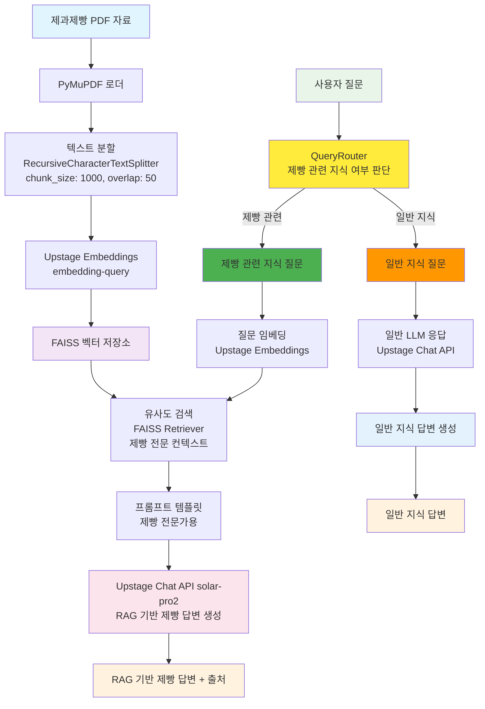

# 제과제빵 문서 기반 RAG 시스템 (LangChain + Upstage)

<br>

## 💻 프로젝트 소개
### <프로젝트 소개>
- 제과제빵 이론·실습 및 자격시험 자료(PDF)를 기반으로 한 한국어 RAG 질의응답 어시스턴트입니다.
- Streamlit WebUI(제빵 테마)에서 대화형으로 질문하고 근거 문서를 함께 제공합니다.

### <작품 소개>
- Upstage Chat/Embeddings와 FAISS를 활용해 제과제빵 전문 지식의 검색·생성을 결합합니다.
- PDF 로드 → 텍스트 분할 → 임베딩 생성 → 벡터 검색 → 답변 생성 파이프라인을 구현했습니다.
- 레시피, 반죽/발효 공정, 온도 관리, 위생·안전 등 주제를 지원합니다.

<br>


## 👨‍👩‍👦‍👦 팀 구성원

|  |  |  |  |  |
| :--------------------------------------------------------------: | :--------------------------------------------------------------: | :--------------------------------------------------------------: | :--------------------------------------------------------------: | :--------------------------------------------------------------: |
|            [류지헌](https://github.com/mahomi)             |            [김태현](https://github.com/huefilm)             |            [박진섭](https://github.com/seob1504)             |            [문진숙](https://github.com/June3723)             |            [김재덕](https://github.com/ttcoaster)             |
|                   팀장, RAG 아키텍처 설계<br/>LangChain 파이프라인 구현                   |                   문서 전처리 및 분할<br/>PDF 로더 최적화                   |                   임베딩 및 벡터 저장소<br/>FAISS 성능 튜닝                   |                   프롬프트 엔지니어링<br/>답변 품질 개선                   |                   API 통합 및 배포<br/>환경 설정 관리                   |

<br>

## 🔨 개발 환경 및 기술 스택
- **주 언어**: Python 3.10+
- **패키지 관리**: UV (Ultra-fast Python package manager)
- **프론트엔드**: Streamlit (WebUI)
- **주요 라이브러리**:
  - **LangChain**: Community, Core, OpenAI, Upstage, Text Splitters
  - **FAISS**: 벡터 검색 및 저장
  - **PyMuPDF**: PDF 문서 처리  
  - **RAGAS**: RAG 시스템 품질 평가
  - **pytest**: 단위/통합 테스트
  - **SQLite**: 대화 데이터 저장
  - **python-dotenv**: 환경변수 관리
- **API**: Upstage AI (Chat, Embeddings)
- **버전 및 이슈관리**: GitHub
- **협업 툴**: GitHub, Slack

<br>

## Upstage API Key 발급
1. [Upstage AI Console](https://console.upstage.ai/docs/getting-started)에 접속합니다.
2. 상단 **Dashboard** 를 클릭
3. 좌측 메뉴에서 **API Key**를 선택합니다.
4. **API Key 발급** 버튼을 클릭하여 키를 생성합니다.
5. 발급된 API Key를 복사하여  `.env` 파일에 추가합니다. (env_template파일을 참고) (`UPSTAGE_API_KEY=발급받은_API_키`)

## ⚙️ UV 명령어 사용법 (실행 가이드)
### UV 설치
```bash
pip install uv
```

### 주요 명령어
```bash
# 기본 RAG 시스템 실행
uv run python code/baseline/baseline.py

# Streamlit WebUI 실행
uv run streamlit run code/main.py

# CLI 데모 실행
uv run python code/test_cli.py

# RAG 품질 평가 실행
uv run python code/evaluate.py

# 테스트 실행
uv run pytest code/tests/

# 의존성 패키지 설치
uv sync

# 새 패키지 추가
uv add 패키지명
```

<br>

## 📁 프로젝트 구조
```
├── code/
│   ├── baseline/             # 기본 RAG 구현
│   │   ├── baseline.py       # 단일 파일 RAG 시스템
│   │   ├── baseline_directoryloader.py  # 다중 파일 처리
│   │   └── baseline_memory.py    # 메모리 기능 포함 버전
│   ├── modules/              # 모듈화된 RAG 컴포넌트
│   │   ├── __init__.py
│   │   ├── sql.py            # SQLite 대화 저장 관리
│   │   ├── logger.py         # 로깅 시스템
│   │   ├── vector_store.py   # 벡터스토어 관리 (통합됨)
│   │   ├── llm.py           # LLM 관리
│   │   ├── retriever.py     # 문서 검색 관리
│   │   ├── chat_history.py  # 채팅 히스토리 관리
│   │   ├── config_loader.py  # 설정 로더
│   │   ├── prompt_loader.py  # 프롬프트 로더
│   │   ├── rag_system.py     # RAG 초기화/Query 처리
│   │   └── router.py         # 질문 라우팅
│   ├── prompts/             # 프롬프트 템플릿
│   ├── tests/               # pytest 테스트 코드
│   ├── main.py              # Streamlit WebUI
│   ├── crawling.py          # 제과/제빵 자료 다운로드·압축해제 유틸
│   ├── config.yaml          # RAG 시스템 설정 파일
│   └── evaluate.py          # RAGAS 품질 평가 도구
├── data/
│   ├── pdf/                 # PDF 문서들
│   ├── vectorstore/         # FAISS 벡터스토어
│   ├── eval/                # 평가 관련 데이터
│   │   ├── question_dataset.json      # 평가용 질문-답변 데이터셋
│   │   └── evaluation_results/        # 평가 결과 저장
└── README.md
```

<br>

## 💻​ 구현 기능

### 1. 기본 RAG 시스템 (baseline/)
- **baseline.py**: 단일 파일 RAG 시스템 구현
- **baseline_directoryloader.py**: 다중 PDF 파일 처리
- **baseline_memory.py**: 대화 메모리 기능 포함

### 2. 모듈화된 RAG 시스템 (modules/)
- **VectorStoreManager**: FAISS 벡터스토어 관리, 증분 업데이트, 파일 변경 감지
- **LLMManager**: Upstage Chat API 통합, 프롬프트 관리
- **RetrieverManager**: 문서 검색, 유사도 기반 검색
- **ChatHistoryManager**: 대화 기록 관리, 메모리 기능
- **SQLManager**: SQLite 기반 대화 저장
- **LoggerManager**: 통합 로깅 시스템
- **ConfigLoader / get_config**: 설정 로딩 및 접근 유틸리티
- **PromptLoader**: 프롬프트 템플릿 로딩
- **RAGSystemInitializer / RAGQueryProcessor**: RAG 파이프라인 초기화 및 질의 처리
- **QueryRouter**: 질의 라우팅

### 3. Streamlit WebUI (main.py)
- 실시간 채팅 인터페이스 (제빵 테마 UI)
- 대화 히스토리 관리 및 메모리 활용 질의응답
- 답변 근거 문서(페이지/파일명) 표시
- `config.yaml` 기반 설정 패널

### 4. 품질 평가 시스템 (evaluate.py)
- **RAGAS 메트릭**: faithfulness, answer_relevancy, context_recall, answer_correctness
- **데이터셋 기반 평가**: 사전 정의된 질문-답변 쌍 사용
- **결과 저장**: JSON 형태로 평가 결과 저장
- **Upstage API 호환**: baseline.py 방식으로 RAGAS 연동

#### RAGAS 평가 지표 상세 설명

**1. Faithfulness (신뢰성)**
- **정의**: 생성된 답변이 제공된 컨텍스트(검색된 문서)에 얼마나 충실한지 측정
- **점수 범위**: 0~1 (높을수록 좋음)
- **의미**: 답변이 컨텍스트에서 벗어나지 않고 사실에 기반하여 생성되었는지 평가
- **중요성**: RAG 시스템의 핵심 지표로, 환각(hallucination) 방지 정도를 나타냄

**2. Answer Relevancy (답변 관련성)**
- **정의**: 생성된 답변이 사용자 질문과 얼마나 관련성이 높은지 측정
- **점수 범위**: 0~1 (높을수록 좋음)
- **의미**: 답변이 질문을 정확히 이해하고 적절하게 응답했는지 평가
- **중요성**: 사용자 의도 파악 및 답변 품질의 기본적인 측정 지표

**3. Context Recall (컨텍스트 재현율)**
- **정의**: 검색된 컨텍스트가 질문에 답하기 위해 필요한 모든 정보를 포함하고 있는지 측정
- **점수 범위**: 0~1 (높을수록 좋음)
- **의미**: 검색 시스템이 관련 문서를 얼마나 잘 찾아내는지 평가
- **중요성**: 검색 품질과 답변 완성도에 직접적인 영향을 미치는 지표

**4. Answer Correctness (답변 정확성)**
- **정의**: 생성된 답변이 정답과 얼마나 일치하는지 측정
- **점수 범위**: 0~1 (높을수록 좋음)
- **의미**: 사전 정의된 정답과 비교하여 답변의 정확성을 평가
- **중요성**: RAG 시스템의 전반적인 성능을 종합적으로 평가하는 지표

**평가 프로세스**
1. **데이터셋 준비**: `data/eval/question_dataset.json`에 질문-정답 쌍 정의
2. **RAG 시스템 실행**: 각 질문에 대해 답변 생성
3. **RAGAS 메트릭 계산**: 4개 지표에 대한 점수 산출
4. **결과 분석**: `data/eval/evaluation_results/`에 JSON 형태로 저장
5. **성능 개선**: 낮은 점수 지표를 중심으로 시스템 최적화

### 5. 테스트 시스템 (tests/)
- **pytest 기반**: 모든 주요 컴포넌트 테스트
- **단위 테스트**: 각 모듈별 기능 검증
- **통합 테스트**: 전체 파이프라인 검증

<br>

## 🛠️ RAG 시스템 아키텍처



### 주요 처리 단계
1. **문서 전처리**: PDF → 텍스트 추출 → 청크 분할
2. **벡터화**: 텍스트 청크 → 임베딩 벡터 → FAISS 인덱스
3. **라우팅**: 질문 유형 분석 → 적절한 처리 경로 선택
4. **검색**: 질문 임베딩 → 유사도 검색 → 관련 문서 추출  
5. **생성**: 질문 + 컨텍스트 → LLM → 최종 답변

### 라우팅 시스템 특징
- **QueryRouter**: 사용자 질문이 제빵 관련 지식인지 일반 지식인지 판단하여 적절한 처리 경로로 라우팅
- **이중 경로 처리**: 
  - **제빵 관련 지식**: RAG 파이프라인을 통한 전문적이고 정확한 답변 생성
  - **일반 지식**: LLM의 일반적인 지식을 활용한 답변 생성
- **효율적 리소스 활용**: 제빵 관련 질문에만 벡터 검색 및 RAG 파이프라인 적용
- **사용자 경험 최적화**: 질문 유형에 맞는 적절한 응답 방식으로 만족도 향상

<br>

## 📊 모델 종류별 RAGAS 평가점수

| embedding모델 | llm모델 | faithfulness | answer_relevancy | context_recall | answer_correctness | ragas_score |
| :--- | :--- | :--- | :--- | :--- | :--- | :--- |
| upstage embedding-query | solar-1-mini-chat | 0.274 | 0.516 | 0.300 | 0.684 | 0.444 |
| upstage embedding-query | solar-pro2 (no reasoning) | 0.318 | 0.444 | 0.457 | 0.607 | 0.456 |
| upstage embedding-query | solar-pro2 (reasoning) | 0.376 | 0.437 | 0.457 | 0.606 | 0.469 |
| upstage embedding-query | gemini-2.0-flash | 0.476 | 0.408 | 0.457 | 0.725 | 0.517 |
| upstage embedding-query | gemini-2.5-flash-lite | 0.500 | 0.415 | 0.457 | 0.793 | 0.541 |
| upstage embedding-query | gemini-2.5-flash | 0.544 | 0.432 | 0.457 | 0.807 | 0.560 |
| gemini-embedding-001 | solar-pro2 (reasoning) | 0.375 | 0.878 | 0.557 | 0.692 | 0.625 |
| gemini-embedding-001 | gemini-2.5-flash | 0.463 | 0.821 | 0.457 | 0.820 | 0.640 |

## 📌 프로젝트 회고
### 멤버별 소감

#### 류지헌
- RAG 아키텍처를 처음부터 끝까지 설계·구현하며, 검색과 생성의 균형을 잡는 것이 핵심임을 다시 확인했습니다. 팀원들과의 빠른 피드백 루프 덕분에 품질을 빠르게 끌어올릴 수 있었고, 운영 관점의 로깅/테스트 중요성도 크게 체감했습니다.

#### 김태현
- 다양한 PDF 형태를 처리하며 로더/전처리 단계의 중요성을 느꼈습니다. 분할 전략과 청크 품질이 검색 성능에 직접적인 영향을 주는 만큼, 기준을 수립하고 재현 가능하게 만든 점이 의미 있었습니다.

#### 박진섭
- 임베딩과 FAISS 튜닝을 반복하며 파라미터가 품질에 미치는 영향도를 경험적으로 정리했습니다. 증분 업데이트와 인덱스 관리 플로우를 정립해 운영 효율을 높일 수 있었습니다.

#### 문진숙
- 프롬프트 엔지니어링을 통해 답변의 일관성과 사실성을 개선했습니다. 실패 사례를 빠르게 수집·학습하여 템플릿과 컨텍스트 구성 규칙을 정리한 것이 큰 성과였습니다.

#### 김재덕
- 프로젝트 전반의 API 통합과 배포 파이프라인 환경 차이로 인한 버그 최소화하여 재현 가능한 실행 가능 환경 구축을 위해 노력했습니다. 설정 관리와 온보딩 가이드를 문서화해 온보딩 시간을 단축할 수 있었던 것 같습니다.


## 📰​ 참고자료
- [Q-NET 제과기능사](https://www.q-net.or.kr/crf005.do?id=crf00503&jmCd=7892)

---

[](https://deepwiki.com/AIBootcamp13/upstageailab-langchain-pjt-langchain_5)
